# PROG 01: Crunch Time

There are 3 main components of the CrunchTime app.

The first component is simply inputting the number of reps or the number of minutes you did of a certain exercise. Then press the "CONVERT" button to convert that amount into calories burned. 

The second component is inputting the number of reps/minutes you did of a certain exercise and then choosing another exercise. You then press the button to turn the amount you did of the first exercise to an equivalent amount of the second exercise.

The third component is inputting the number of calories you would like to burn and specifying an exercise. You then press the button to tell you how many of the specified exercise you need to do to burn the number of calories you specified.

## Authors

Derrick Hu ([HuDerrick@berkeley.edu](mailto:HuDerrick@berkeley.edu))

## Demo Video

See [your demo video title here] (https://link_to_your_video)

## Screenshots

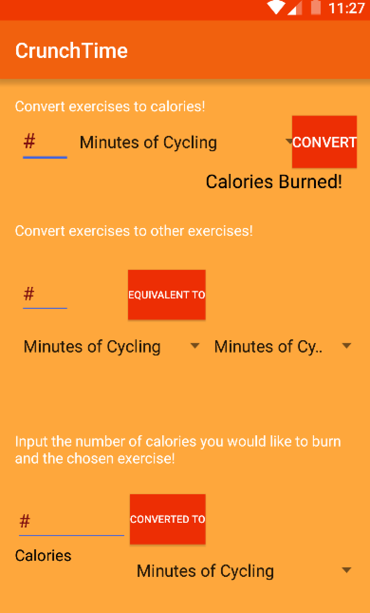

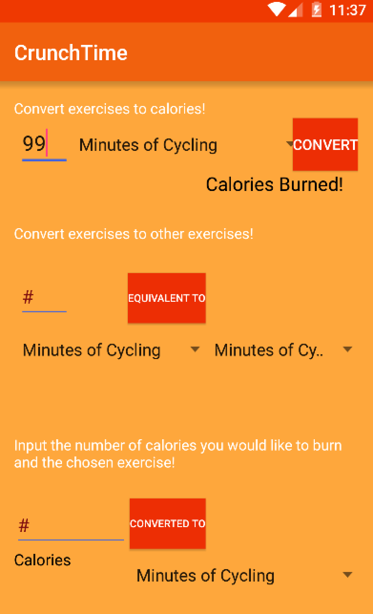
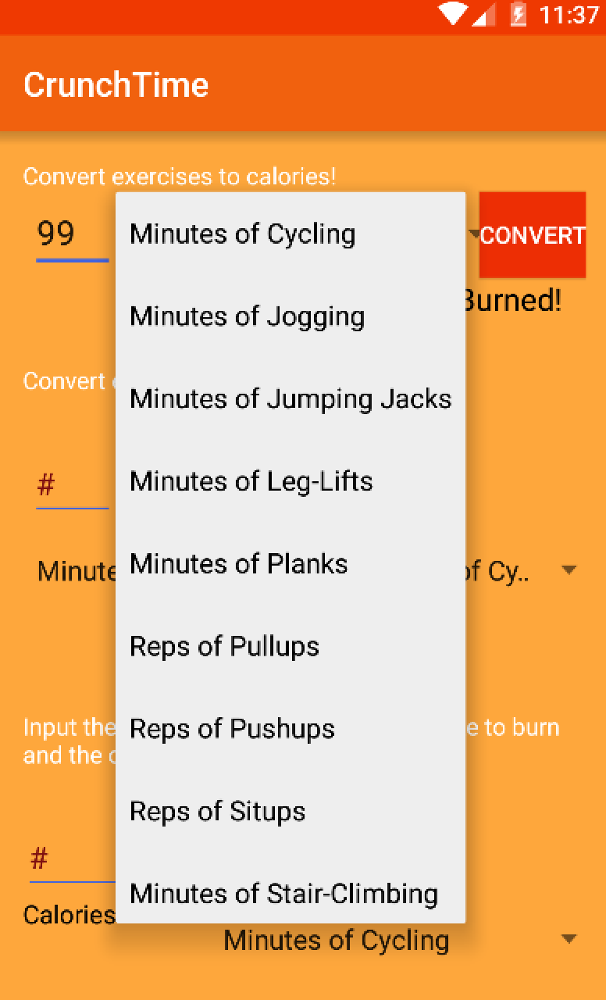
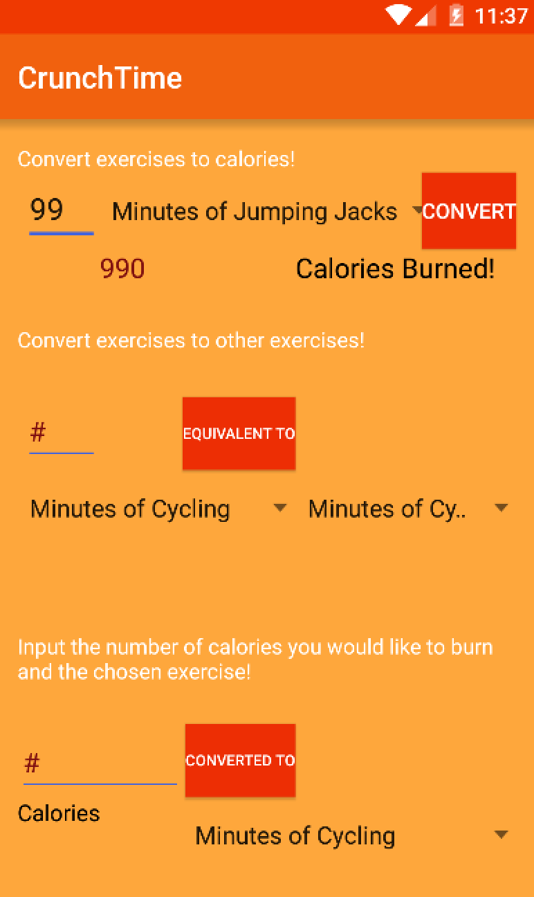
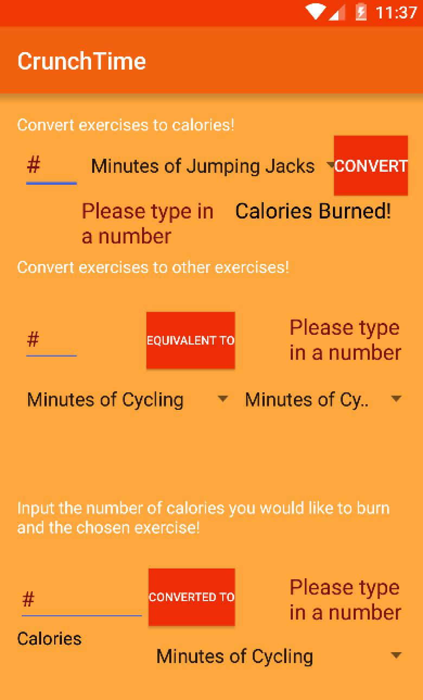

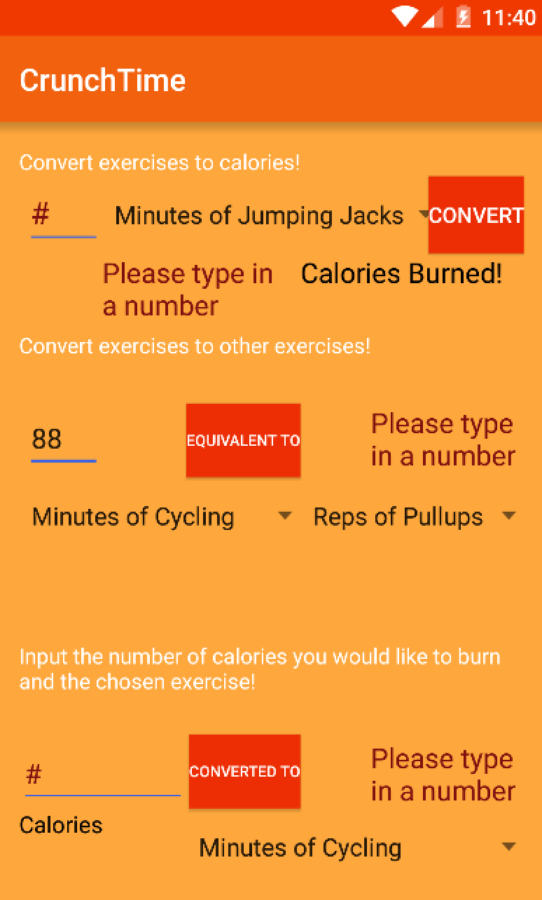
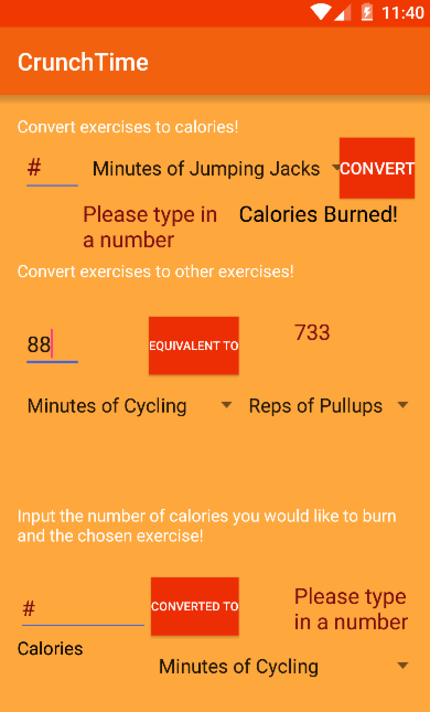
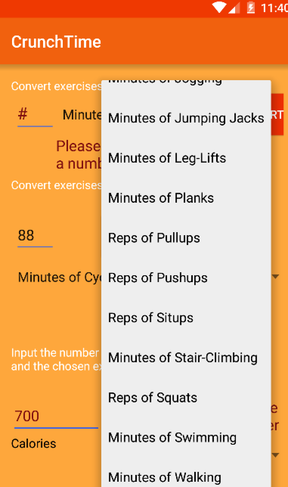
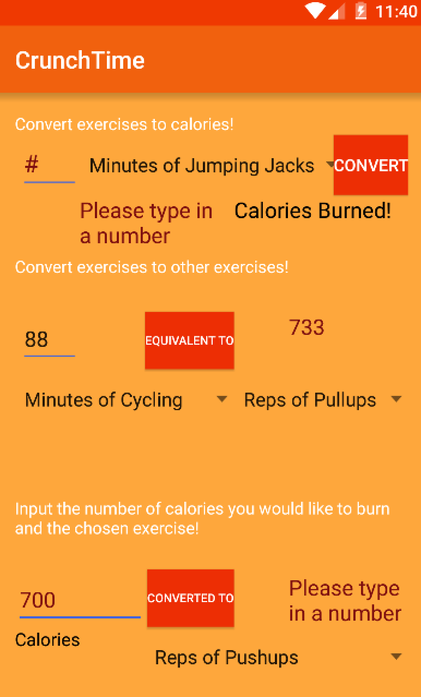
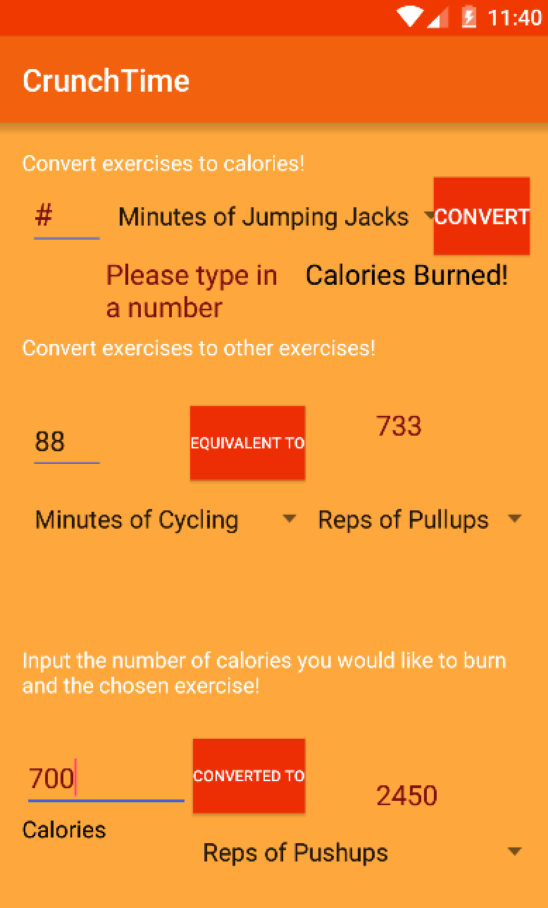
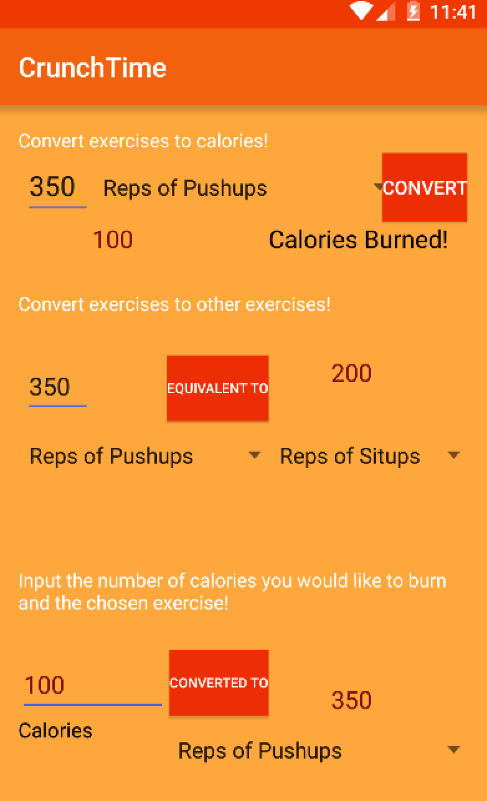

## Acknowledgments

* Hat tip to anyone who's code was used
* Any other support

