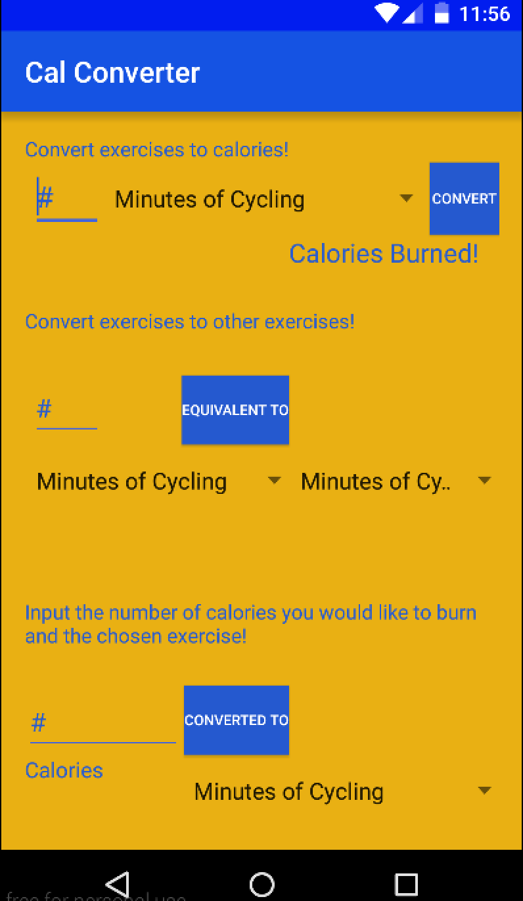

# PROG 01: Cal Converter

There are 3 main components of the Cal Converter app.

The first component is simply inputting the number of reps or the number of minutes you did of a certain exercise in the input line. Next choose the exercise you did from the dropdown spinner. Finally press the "CONVERT" button to convert that amount of exercise into calories burned. If you somehow pressed the "CONVERT" button without inputting a number, an error message will appear telling you to input a number. 

The second component is inputting the number of reps/minutes you did and then choosing the certain exercise that you did from the dropdown spinner. Then choose another exercise that you wish to convert this amount of exercise to from the right dropdown spinner. You then press the “EQUIVALENT TO” button to turn the amount you did of the first exercise to an equivalent amount of the second exercise.

The third component is inputting the number of calories you would like to burn and then specifying an exercise from the dropdown spinner. You then press the button “CONVERTED TO” to tell you how many of the specified exercise you need to do to burn the number of calories you specified.

## Authors

Derrick Hu ([HuDerrick@berkeley.edu](mailto:HuDerrick@berkeley.edu))

## Demo Video

See [Cal Converter] (https://www.youtube.com/watch?v=wYtg2FcV8bc&feature=youtu.be)

## Screenshots

## Acknowledgments

